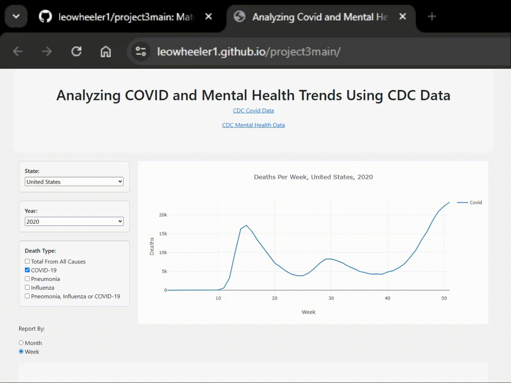
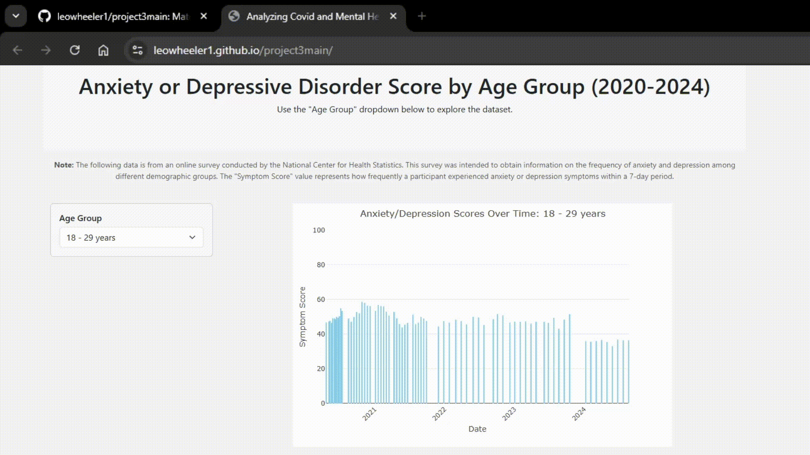
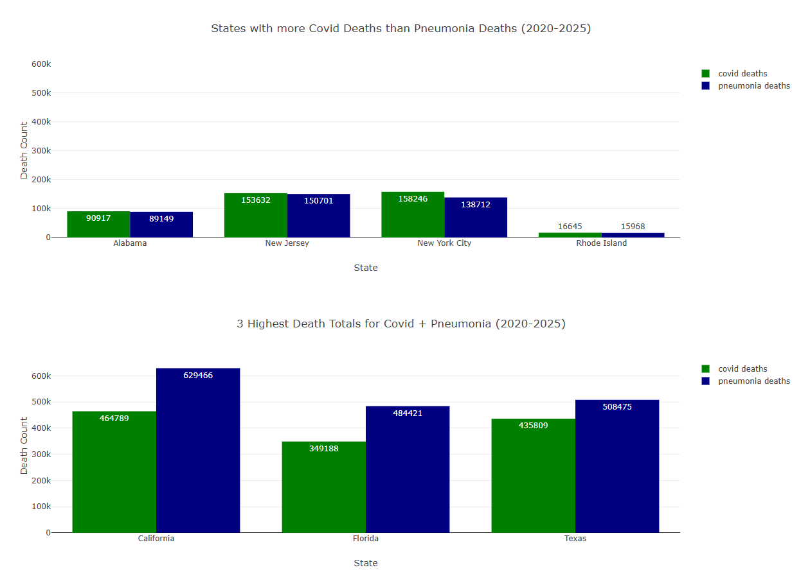
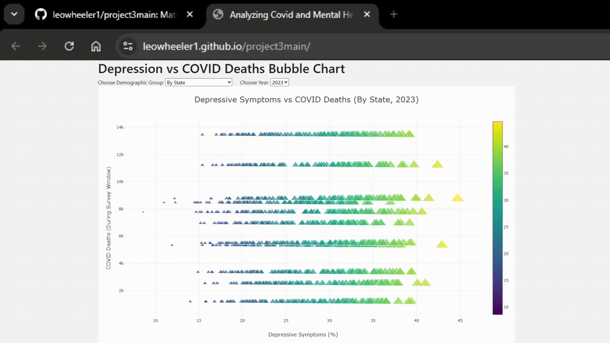

# COVID-19 and Mental Health Data Project

## Repo Directory
#### [1. Data](data) - `.csv` files that were used to populate relational database and `.json` files that were used for plotting
#### [2. Images](images) - all images and gifs used in readme
#### [3. Schema](schema) - setup for the relational database
#### [4. Static/js](static/js) - `.js` files that power the visualizations
#### [5. README.md](README.md) - you are here ;)
#### [6. `cleanup.ipynb`](cleanup.ipynb) - inital API call and conversion to `.csv`
#### [7. `index.html`](index.html) - HTML page to support visualizations
#### [8. `psycopg2.ipynb`](psycopg2.ipynb) - (Locally) calling data from relational database and converting the output to a json object for use with graphing

## Project Overview
  - For this project we wanted to synthesize COVID-19 data and Mental Health data to see what kind of correlations, if any, we could find. Some of the questions we sought to answer were:
      - What states saw the most COVID cases?
      - Were any other illnesses prominent in these areas as well?
      - What demographics are most impacted by anxiety and depression?
      - What trends exist between states?
      - How do the areas most impacted by COVID cases and anxiety/depression compare?
  - We decided to use an API to call for the initial data from the CDC. That data went through a cleaning process and was then converted  into a .csv file, which was then loaded into a PostgresQL database. Github Pages was leveraged to host the interactive visualizations that resulted from our study. Javascript as well as HTML/CSS were used to run these visualizations. Psycopg2 was used to take information from PostgresQL into Python to further refine into JSON objects for our interactive visualizations. Last but not least we used D3 and Plotly to further increase the power of our visualizations.

## Instructions -- [Interactive Viz Here](https://leowheeler1.github.io/project3main/)
  - The link above goes to the github pages deployment for all the visualizations produced during our study. Below are instructions on how to use each plot on the deployment and what they tell you.
  - Plot 1 instructions: This visualization displays deaths for COVID-19, pneumonia, influenza as well as total deaths per state and per year, reported either weekly or monthly.  Simply select the “State,” “Year,” “Death Type,” and “Report By” options you are interested in.  The graph will update automatically to display      the data you are interested in.
     
  - Plot 2 instructions: This interactive visualization displays CDC Mental Health data. It does this through a bar chart, organized by year and anxiety/depression symptom score. With the "Age Group" dropdown, the data can be filtered to specific age group ranges.
    
  - Plot 3+4 instructions: These ones are static, nothing to worry about except reading them. The first one shows the three states (and one city) that had more deaths from Covid-19 than Pneumonia between 2020-2025. The second one shows the three highest death counts among all states, cities, and territories in the dataset.  
     
  - Plot 5 instructions: This graph aggregates deaths during given survey windows and plots that against depression scores. The heatmap goes along the x axis, and there are varying shapes for different years. To use this graphic, please choose the demographic and year from the dropdown window. The tooltip from top to bottom left to right gives depression score, deaths in window, demographic, and survey window time.
    
## Ethical Considerations
  - For this project, we used data from the CDC. We ourselves are not interfering with any end user licensing agreements nor are we stealing data that we should not have access to. This data has been sourced ethically from public spaces and is being used for educational purposes. 
  - Additionally notable are the CDC Guidelines for Data Sharing and Collections, cited in Other References. The CDC follows ten principles that bolster 5 standards to keep their data practices sharp and up to code. They are:
      - Public health data should be acquired, used, disclosed, and stored for legitimate public health purposes.
      - Programs should collect the minimum amount of personally identifiable information necessary to conduct public health activities.
      - Programs should have strong policies to protect the privacy and security of personally identifiable data.
      - Data collection and use policies should reflect respect for the rights of individuals and community groups and minimize undue burden.
      - Programs should have policies and procedures to ensure the quality of any data they collect or use.
      - Programs have the obligation to use and disseminate summary data to relevant stakeholders in a timely manner.
      - Programs should share data for legitimate public health purposes and may establish data-use agreements to facilitate sharing data in a timely manner.
      - Public health data should be maintained in a secure environment and transmitted through secure methods.
      - Minimize the number of persons and entities granted access to identifiable data.
      - Program officials should be active, responsible stewards of public health data.

  - Since the data is accessible through a public API, contains no sensitive information about any individuals, and this is a study on correlation between COVID-19 and mental health, this is an ethical source of data and is being used as intended. 

## References (Data)
  - National Center for Health Statistics. Provisional COVID-19 Death Counts by Week Ending Date and State. Date accessed: April 7, 2025
        - https://data.cdc.gov/NCHS/Provisional-COVID-19-Death-Counts-by-Week-Ending-D/r8kw-7aab/data_preview
  - National Center for Health Statistics. U.S. Census Bureau, Household Pulse Survey, 2020–2024. Anxiety and Depression. Generated interactively: April 7, 2025
        - https://www.cdc.gov/nchs/covid19/pulse/mental-health.htm

## Other References
  - CDC Data Guidelines
        - https://www.cdc.gov/program-collaboration-service-integration/php/data-security/principles.html

## Credits
    - Leo Wheeler (Preprocessing data, PostgreSQL DB setup & README.md)
    - Jacob Brown (Interactive visualization of COVID dataset)
    - Liliana Guevara-Guerrero  (Interactive visualization of Mental Health dataset)
    - Connor Beaton (General assistance, Interactive Bubble Chart, Proposal & README.md)
